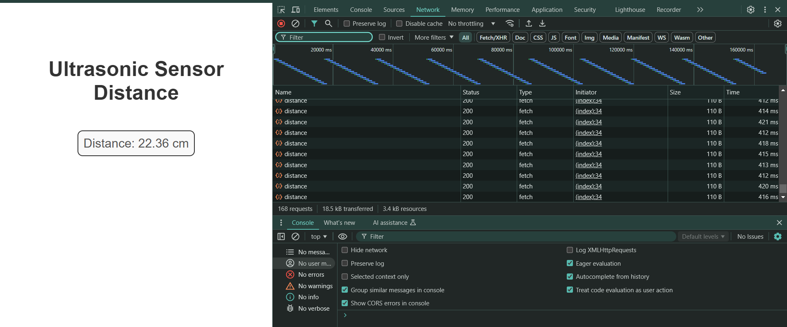

# ESP_Ultrasonic_Dashboard

### ESP32-Based Distance Measurement System with RGB LED Indication and Wi-Fi Data Hosting

This project demonstrates a distance measurement system powered by the ESP32 microcontroller, incorporating dynamic interaction and remote monitoring features.

## Features

- **Ultrasonic Distance Measurement**: Measures distance using ultrasonic sensors with high accuracy.
- **RGB LED Indication**: The RGB LED changes color based on distance thresholds, providing instant visual feedback.
- **Buzzer Alert**: A buzzer is triggered when the measured distance falls below 30 cm, acting as a warning mechanism.
- **Wi-Fi Data Hosting**: The ESP32 hosts a web server, allowing real-time distance data representation via a user-friendly web interface.

## Project Setup and Web interface




## Overview

This system is a compact and interactive solution for proximity detection, offering versatile feedback and remote monitoring:
1. Measured distances control the RGB LED color dynamically.
2. A buzzer provides an audio alert for close proximity (less than 30 cm).
3. Real-time distance data is accessible via a Wi-Fi-enabled web server, ensuring ease of monitoring.

## Applications

- Proximity alert systems.
- Object detection in automation or robotics.
- Smart monitoring for confined spaces.

## Project Structure

- **/src**: Source code for the ESP32 firmware.
- **/web**: Files for the Wi-Fi-hosted web interface.
- **/docs**: Circuit diagrams and additional documentation.
- **README.md**: Project overview and setup guide.

## Getting Started

### Prerequisites

- ESP32 development board.
- Ultrasonic sensor (HC-SR04).
- RGB LED.
- Buzzer.
- Resistors, jumper wires, and a breadboard.

### Installation

1. Clone the repository:
   ```bash
   git clone https://github.com/Vaibhav-1308/ESP_Ultrasonic_Dashboard.git
